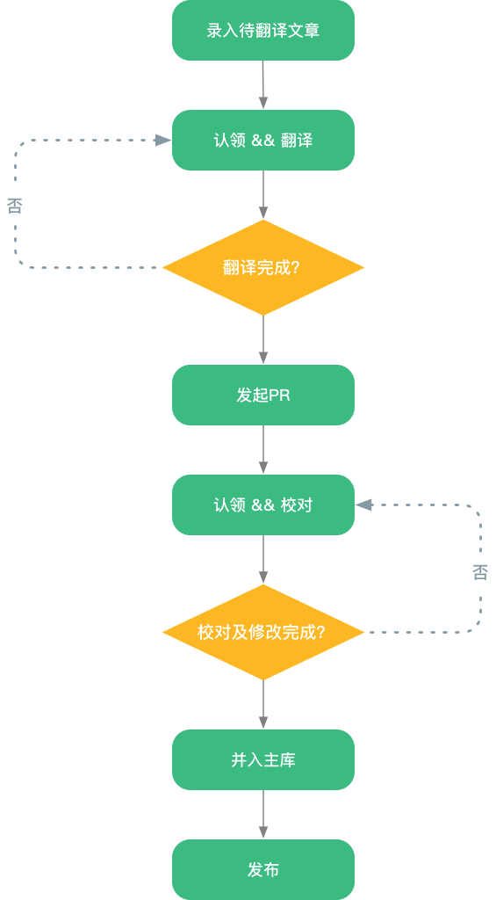

# 阿里云翻译小组

## 是什么？
翻译小组是「阿里云中台体验技术部」内部发起的，主要由团队成员组成的兴趣小组，翻译内容主要为前端相关的国外优秀技术文章。

## 为什么？
- 提高团队技术氛围
- 为社区贡献优质的中文技术文章
- 精读文章，提高自身和团队技术储备
- 相较纯原创的文章，过程中的互动较多，颗粒更小，能够收获阅读和写作能力

## 怎么做？

[如何推荐优秀文章？]()

[如何参与翻译？]()

[如何参与校对？]()

[如何发布翻译好的文章？]()

## 目标
每周产出至少一篇译文

## 翻译节奏
周一至周四完成文章翻译，周五至周六完成文章校对，周日发布
